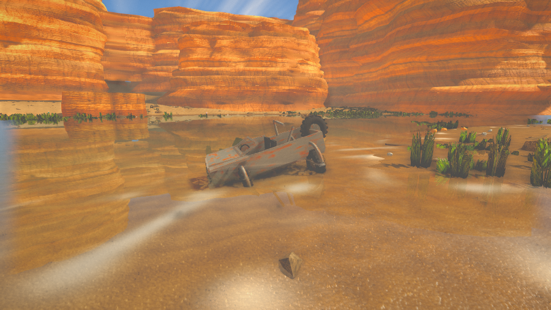

# Oasen

En lille, stille førstepersons-oase i en sandstenskløft — bygget til at blive
åbnet direkte i browseren. Ingen server, ingen build-kæde, ingen assets at
hente: terræn, klipper, vand, græs, teksturer og lyd bliver genereret i
browseren, når siden åbnes.

Inspireret af *Stranded Deep* og af referencebilledet med floden mellem
lagdelte kløftvægge.




## Prøv den

**Som program på din Mac** (kraftigst — hele grafikkortet, ingen browserfane):

```bash
cd desktop
npm install          # første gang
npm start            # bygger scenen og åbner Oasen som program
```

Programmet henter ANGLE's Metal-backend, beder om det kraftigste grafikkort på
maskinen og starter på niveauet **Kino**, som er for tungt til en browser.
Menuen **Grafik** skifter niveau, og `npm run start:uncapped` slipper
billedraten fri af skærmens opdateringsfrekvens (maskinen bliver varmere).

En rigtig `.app`-fil laves med `npm run dist` (kræver at du kører på macOS);
resultatet lander i `desktop/build/`.

**I browseren:** åbn `dist/oasen.html` — én selvstændig fil, dobbeltklik den, og
den kører (også uden internet). Her starter den på **Middel**; niveauet vælges
på startskærmen, og valget huskes.

**Fra kildekoden:** kør en lille webserver i mappen, fordi browsere ikke må
læse sidemoduler fra `file://` på tværs af filer:

```bash
python3 -m http.server 8000
# åbn http://localhost:8000
```

Byg enkeltfilen igen efter ændringer:

```bash
node tools/build.js
```

## Når det driller

Bliver skærmen grå eller sort, er det næsten altid grafikhukommelsen, der er
løbet tør, og browseren har taget WebGL-konteksten fra siden. To knapper på
startskærmen hjælper:

- **Sikker tilstand** (eller `?safe=1` i adressen) kører den enkleste vej
  gennem motoren: ingen efterbehandling, ét almindeligt skyggekort, ingen
  ekstra vandpas. Virker den, er grundmotoren i orden, og det er et af de
  tunge lag, der fejler.
- **Diagnostik** (eller `F2`) viser grafikkort, browser, opløsning, niveau og
  alle fejl, siden har fanget — med en knap der kopierer hele rapporten.

Rendering-løkken fanger desuden fejl undervejs: går efterbehandlingen i
stykker på en driver, skifter spillet selv til simpel visning og skriver
hvorfor, i stedet for at fryse.

## Grafikniveauer

Pixeltætheden er den dyreste enkeltknap — den koster kvadratisk på hver eneste
buffer. Derfor har hvert niveau både et loft over pixeltætheden og et samlet
loft over antal pixels, uanset hvor stor skærmen er.

| Niveau | Skygger | Vandspejling | AO | Parallax | Planteklynger |
| --- | --- | --- | --- | --- | --- |
| Lav | 2 × 1024 | 35 % | – | – | 550 |
| Middel | 2 × 1024 | 50 % | – | – | 900 |
| Høj | 3 × 1536, blød | 70 % | ✓ | ✓ | 1200 |
| Ultra | 3 × 2048, blød | 100 % | ✓ | ✓ | 1500 |
| Kino (kun program) | 4 × 3072, blød | 100 % | ✓ | ✓ | 2400 |

Falder billedraten under 30 pr. sekund, trapper spillet selv ned i tre trin —
først ambient occlusion og solstråler, så vandets opløsning, til sidst
billedopløsningen — og skriver det på startskærmen i stedet for bare at hakke.

## Styring

| Tast | Handling |
| --- | --- |
| `WASD` / piletaster | gå |
| `Shift` | løb |
| Mus | kig (klik for at fange musen; virker også som træk-for-at-kigge) |
| `E` eller klik | saml sten op |
| `F` | skjul HUD (til skærmbilleder) |
| `M` | lyd til/fra |
| `Esc` | slip musen |

Man kan vade ud i floden, men ikke svømme — bliver der for dybt, stopper man.

## Stenene

Der ligger godt 200 sten spredt langs bredden. De sjældne gløder svagt, så man
kan få øje på dem på afstand:

| Sten | Sjældenhed |
| --- | --- |
| Flintesten, sandstensbrokke, poleret flodsten | almindelig |
| Jernholdig sten, kvartskrystal | usædvanlig |
| Stribet agat, ametyst | sjælden |
| Stjernesten | legendarisk (ca. 1 ud af 130 sten) |

## Hvordan det er lavet

Ren JavaScript oven på three.js (r128 med et par efterbehandlings-moduler,
som ligger i `vendor/`). Filerne indlæses i rækkefølge og deler navnerummet
`window.OASIS`:

| Fil | Ansvar |
| --- | --- |
| `src/00-core.js` | matematik, støjfunktioner, farvekonvertering, konfiguration |
| `src/15-atmosphere.js` | luften: retningsbestemt indspredning, højdeprofil og varmt jordskær |
| `src/25-shaderlib.js` | indgreb i standardmaterialet: ekstra detaljenormal, våd overflade, storskala-variation |
| `src/10-world.js` | flodens forløb og terrænets højdefunktion — alle andre moduler spørger herind |
| `src/20-textures.js` | sand, sandsten, sten, græs, bølgenormaler og skum tegnet på canvas — med farve-, normal- og ruhedskort |
| `src/30-terrain.js` | terrænmesh med vertexfarver (våd sand, tør sand, grus, grønt bånd) |
| `src/40-cliffs.js` | mesaer som indekserede gitre med lagprofil, lodrette render og udhæng |
| `src/50-sky.js` | atmosfærisk himmel, miljøkort (IBL) bagt fra himlen, kaskade-skygger og fyldlys |
| `src/60-water.js` | vandet: planspejling, brydning, absorption efter dybde, kaustik og skum |
| `src/70-props.js` | græs i klynger, buske, nedfaldsklippe, grus, drivtømmer, bål, støv |
| `src/75-wreck.js` | den gamle jeep i det lave vand: rust, algevækst, begravet hjul |
| `src/80-stones.js` | de sten man kan samle op, og deres sjældenhed |
| `src/85-player.js` | bevægelse, kollision, vadning, hovedbevægelse og hånden |
| `src/90-audio.js` | vind, vand, skridt og opsamlingsklang syntetiseret med WebAudio |
| `src/95-hud.js` | sigtekorn, prompt, lomme og beskeder |
| `src/97-post.js` | render-pipeline: HDR-buffer, ambient occlusion, solstråler, bloom, filmisk gradering, SMAA |
| `src/98-diagnostics.js` | fejlopsamling og rapport på skærmen (F2) |
| `src/05-quality.js` | grafikniveauer, hukommelsesbudget og sikker tilstand |
| `src/99-main.js` | opstart, indlæsningsskærm og renderløkke |

Det tunge lag — hvad der faktisk giver dybden:

- **Lyset kommer fra hele himlen.** Himlen renderes én gang til et miljøkort
  (PMREM), som alle materialer bruger. Uden det bliver alt i skygge fladt og
  gråt.
- **Kaskade-skygger (CSM).** Ét skyggekort kan ikke dække både grusset ved
  fødderne og klippen 150 m væk. Synsfeltet deles i tre kaskader, så det nære
  får sin egen høje opløsning, og skyggerne sløres i selve skyggekortet (VSM),
  så kanten har en halvskygge i stedet for at være klippet.
- **Ambient occlusion** beregnes fra scenens dybdebuffer — altså uden et
  eneste ekstra geometri-pas. Det er det bløde mørke i sprækker, under sten og
  hvor græsset møder jorden; øjet bruger det til at afgøre, om ting rent
  faktisk står på jorden.
- **Luften mellem os og klipperne** er ikke bare én tågefarve. Indspredningen
  er retningsbestemt (luften lyser kraftigst mod solen), ligger tættest nede
  ved floden og får et varmt skær af støvet nær jorden.
- **Parallax occlusion mapping**: blikket marcherer ned i højdekortet, så
  sandribber og stenlag skygger for hinanden i stedet for at være en flad
  tegning. Effekten tones ud med afstanden.
- **Solstråler** dannes kun af selve solskiven — sætter man tærsklen for lavt,
  smører hele himlens lys sig ud som en hvid dis.
- **Vandet** spejler scenen fra et spejlvendt kamera i fuld opløsning (en
  uskarp spejling ligner tåge) og bryder den fra et tredje pas, så man ser
  bunden gennem det klare vand. Begge hjælpebilleder er half-float, ellers
  klippes sol og lyse klipper til hvidt. Lyset slukkes eksponentielt med
  dybden — rødt først — og kaustikken tegnes på bunden, hvor den hører til.
- **Kløftens lag er geometri**: indekserede gitre med lagprofil, hylder,
  udhæng og lodret erosion, bløde normaler og nedfaldsklippe ved foden.
- **Bevoksningen** er fire arter — friskt græs, tørt strå, brede blade og tørre
  buske — sået i klynger, hvor arten følger fugtigheden. Ensartet bevoksning
  er en af de tydeligste røbere af noget computergenereret.
- **Vraget i vandet** er ikke bare en model, der er skubbet ned under
  overfladen. Materialet ved, hvor vandet står: alt under overfladen bliver
  mørkt og begroet, lige over sidder en våd, mørk stribe, og over den igen en
  lys saltrand. Kaustikken fra bølgerne løber hen over det nedsunkne. Det er
  dét, der får noget til at ligge *i* vandet frem for *på* det.
- **Ydelse**: alt græs, sten og grus tegnes som instanser, klipperne er flettet
  til ét mesh, skyggekortene tegnes én gang pr. billede (ikke også i vandets
  ekstra pas), og de to vandpas springer det mindste pynt over og slukkes
  langt fra vandet. Falder billedraten, skruer spillet selv ned for
  ambient occlusion, solstråler, bloom, vandets opløsning og til sidst
  billedopløsningen.

## Teksturer og kreditering

Sandet, gruset, klippernes overflade, vandets normalkort og kaustikken er
fotografiske teksturer hentet fra frit tilgængelige samlinger på GitHub og
skaleret ned til brug her. De ligger i `assets/` og pakkes ind i koden med
`node tools/pack-assets.js`, fordi den samlede enkeltfil skal kunne åbnes
uden internet.

- `sand.jpg`, `ground.jpg`, `rock_normal.jpg`, `rock_grain.jpg` — [BabylonJS/Assets](https://github.com/BabylonJS/Assets),
  Creative Commons Attribution 4.0 International (CC BY 4.0)
- `sand_normal.jpg` — udledt af `sand.jpg` (Sobel-filter), afledt værk under samme licens
- `water_normal.jpg`, `caustics.jpg` — [three.js](https://github.com/mrdoob/three.js)
  (MIT); kaustikken stammer oprindeligt fra OpenGameArt

Den fulde liste står i [`assets/CREDITS.md`](assets/CREDITS.md).

## Værktøjer

- `tools/build.js` — samler alt til `dist/oasen.html`
- `tools/shot.js` — tager skærmbilleder af faste udsigter med headless Chromium
  (`node tools/shot.js <mappe>`), brugt til at finpudse grafikken
- `tools/pack-assets.js` — pakker teksturerne i `assets/` ind i
  `src/22-assets.js` som data-URI'er; kør den efter ændringer i `assets/`
