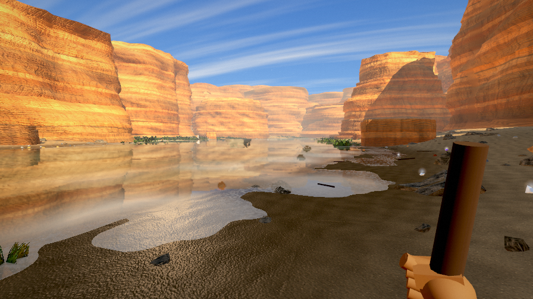
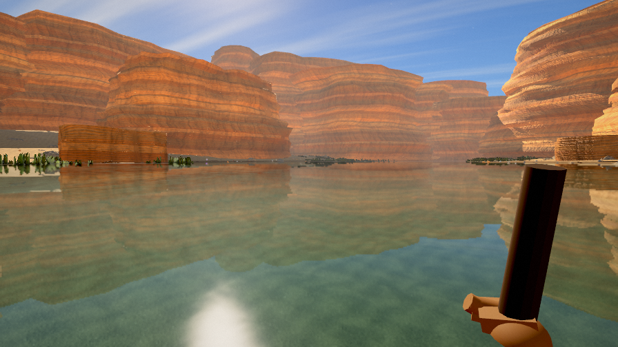

# Oasen

En lille, stille førstepersons-oase i en sandstenskløft — bygget til at blive
åbnet direkte i browseren. Ingen server, ingen build-kæde, ingen assets at
hente: terræn, klipper, vand, græs, teksturer og lyd bliver genereret i
browseren, når siden åbnes.

Inspireret af *Stranded Deep* og af referencebilledet med floden mellem
lagdelte kløftvægge.




## Prøv den

**Nemmest:** åbn `dist/oasen.html` — én selvstændig fil, dobbeltklik den, og
den kører (også uden internet).

**Fra kildekoden:** kør en lille webserver i mappen, fordi browsere ikke må
læse sidemoduler fra `file://` på tværs af filer:

```bash
python3 -m http.server 8000
# åbn http://localhost:8000
```

Byg enkeltfilen igen efter ændringer:

```bash
node tools/build.js
```

## Styring

| Tast | Handling |
| --- | --- |
| `WASD` / piletaster | gå |
| `Shift` | løb |
| Mus | kig (klik for at fange musen; virker også som træk-for-at-kigge) |
| `E` eller klik | saml sten op |
| `F` | skjul HUD (til skærmbilleder) |
| `M` | lyd til/fra |
| `Esc` | slip musen |

Man kan vade ud i floden, men ikke svømme — bliver der for dybt, stopper man.

## Stenene

Der ligger godt 200 sten spredt langs bredden. De sjældne gløder svagt, så man
kan få øje på dem på afstand:

| Sten | Sjældenhed |
| --- | --- |
| Flintesten, sandstensbrokke, poleret flodsten | almindelig |
| Jernholdig sten, kvartskrystal | usædvanlig |
| Stribet agat, ametyst | sjælden |
| Stjernesten | legendarisk (ca. 1 ud af 130 sten) |

## Hvordan det er lavet

Ren JavaScript oven på three.js (r128 med et par efterbehandlings-moduler,
som ligger i `vendor/`). Filerne indlæses i rækkefølge og deler navnerummet
`window.OASIS`:

| Fil | Ansvar |
| --- | --- |
| `src/00-core.js` | matematik, støjfunktioner, farvekonvertering, konfiguration |
| `src/25-shaderlib.js` | indgreb i standardmaterialet: ekstra detaljenormal, våd overflade, storskala-variation |
| `src/10-world.js` | flodens forløb og terrænets højdefunktion — alle andre moduler spørger herind |
| `src/20-textures.js` | sand, sandsten, sten, græs, bølgenormaler og skum tegnet på canvas — med farve-, normal- og ruhedskort |
| `src/30-terrain.js` | terrænmesh med vertexfarver (våd sand, tør sand, grus, grønt bånd) |
| `src/40-cliffs.js` | mesaer som indekserede gitre med lagprofil, lodrette render og udhæng |
| `src/50-sky.js` | atmosfærisk himmel, miljøkort (IBL) bagt fra himlen, sol, skygger og fyldlys |
| `src/60-water.js` | vandet: planspejling, brydning, absorption efter dybde, kaustik og skum |
| `src/70-props.js` | græs i klynger, buske, nedfaldsklippe, grus, drivtømmer, bål, støv |
| `src/80-stones.js` | de sten man kan samle op, og deres sjældenhed |
| `src/85-player.js` | bevægelse, kollision, vadning, hovedbevægelse og hånden |
| `src/90-audio.js` | vind, vand, skridt og opsamlingsklang syntetiseret med WebAudio |
| `src/95-hud.js` | sigtekorn, prompt, lomme og beskeder |
| `src/97-post.js` | efterbehandling: bloom, filmisk farvegradering, vignet og kantudjævning |
| `src/99-main.js` | opstart, indlæsningsskærm og renderløkke |

Et par detaljer der gør udslaget:

- **Lyset kommer fra hele himlen.** Himlen renderes én gang til et miljøkort
  (PMREM), som alle materialer bruger. Uden det bliver alt i skygge fladt og
  gråt; med det får sand og klipper himlens farve ovenfra.
- **Spejlingen i vandet** er ikke en tekstur. Scenen renderes en ekstra gang
  fra et kamera spejlet i vandfladen, og en tredje gang uden vandet, så
  overfladen både kan spejle kløften og vise bunden gennem det klare vand.
  Begge hjælpebilleder gemmes i half-float, så sol og lyse klipper ikke
  klippes til hvidt — det er ellers præcis dét, der får vand til at ligne mælk.
- **Dybden styrer farven.** Et dybdekort bages fra samme højdefunktion som
  terrænet, og lyset slukkes eksponentielt med dybden (rødt først). Derfor er
  det lave vand sandfarvet og det dybe grønblåt, med kaustik og en smal
  skumbræmme langs kanten.
- **Kløftens lag er geometri.** Hver formation er et indekseret gitter, hvor
  radius bestemmes af en lagprofil med hylder og udhæng plus lodret erosion.
  Bløde normaler og nedfaldsklippe ved foden fjerner det kantede lav-poly-look.
- **Våd sand er blank.** En vertex-attribut markerer bræmmen langs vandkanten,
  og materialet gør den både mørkere og mere spejlende dér — men kun ovenfor
  vandet, for under vandet klarer absorptionen det selv.
- **Efterbehandling** binder billedet sammen: bloom på de lyseste steder,
  filmisk kurve med varme højlys og kølige skygger, vignet og — på WebGL2 —
  ægte multisamplet kantudjævning.
- **Ydelse**: græs, sten og grus tegnes som instanser, klipperne er flettet
  til ét mesh, og de to ekstra vandpas kører i nedsat opløsning, springer det
  mindste pynt over og slukkes helt, når man er langt fra vandet. Falder
  billedraten, skruer spillet selv ned for opløsning og bloom.

## Værktøjer

- `tools/build.js` — samler alt til `dist/oasen.html`
- `tools/shot.js` — tager skærmbilleder af faste udsigter med headless Chromium
  (`node tools/shot.js <mappe>`), brugt til at finpudse grafikken
